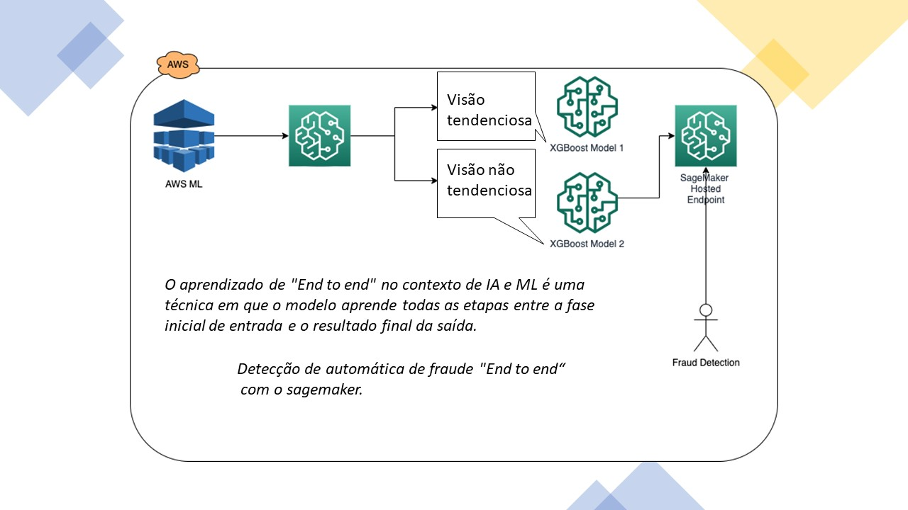
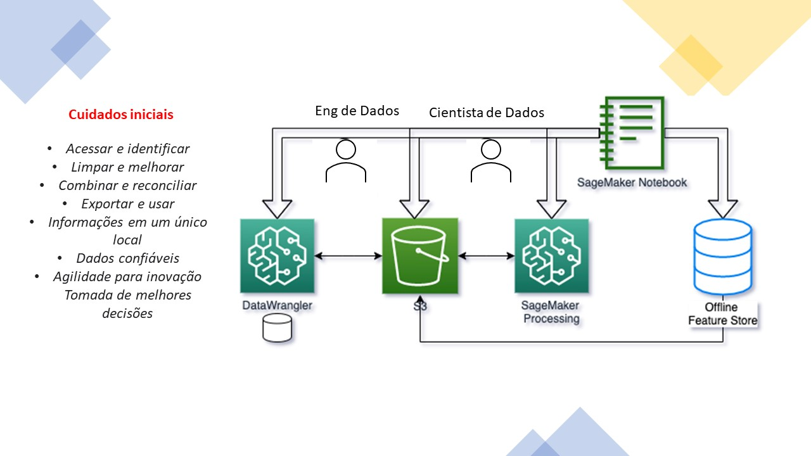
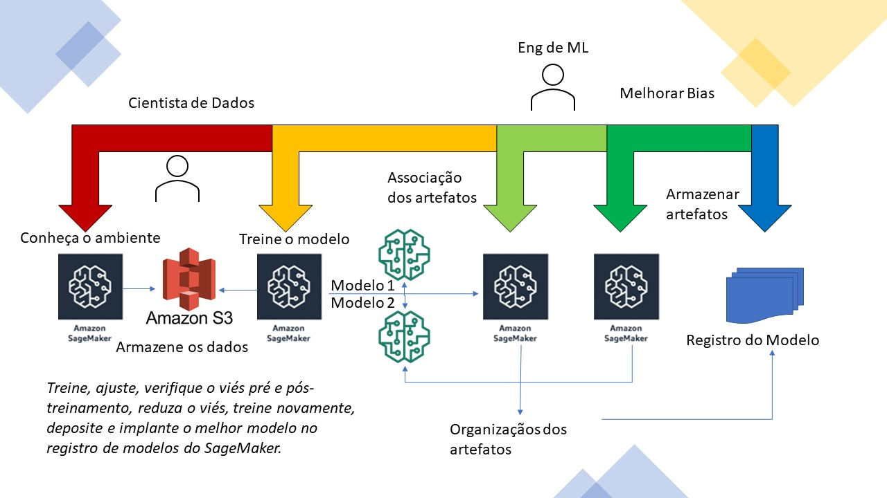
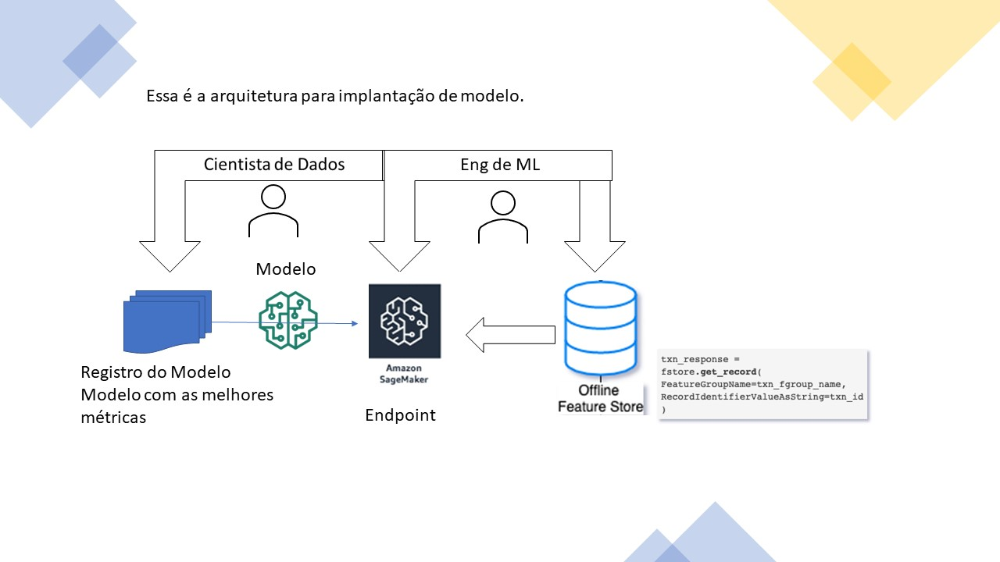
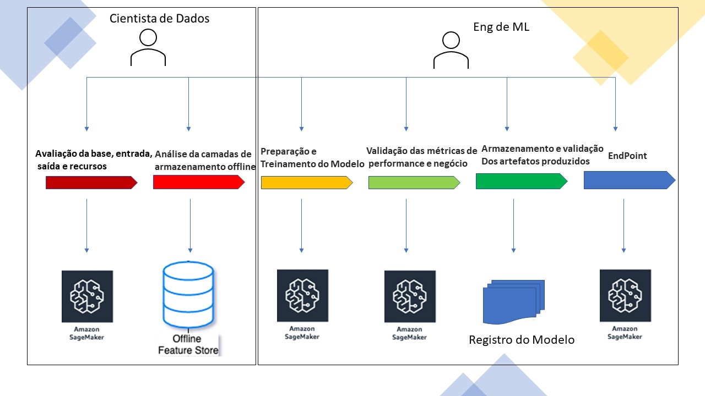
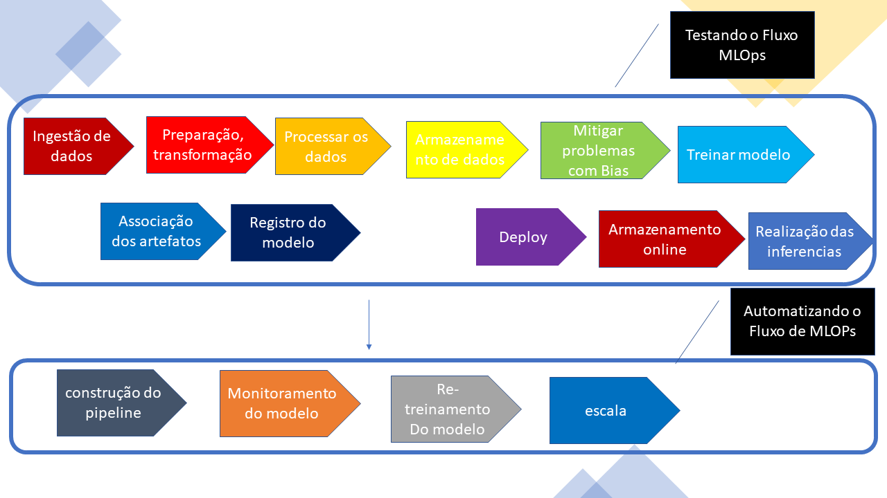
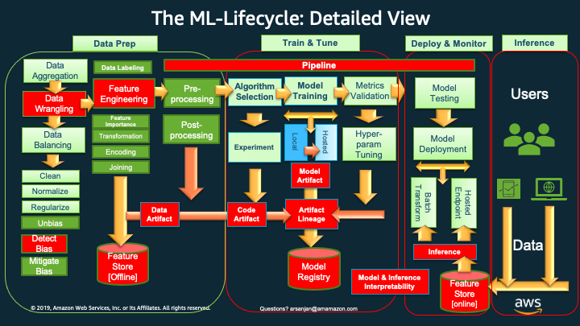

# Arquitete e crie um fluxo de trabalho Endtoend para detecção  de fraudes com os serviços SageMaker.

O objetivo deste exemplo Endtoend é demonstrar como preparar, treinar e implantar um modelo que detecta falhas em seguros de automóveis.

## Conteúdo
1. [Problema de negócios](#business-problem)
2. [Solução Técnica](#nb0-solution)
3. [Componentes da solução](#nb0-components)
4. [Arquitetura da solução](#nb0-arquitetura)
5. [Recursos de código](#nb0-code)
6. [Fluxos de trabalho exploratórios de ciência de dados e ML operacional](#nb0-workflows)
7. [Ciclo de vida do modelo de ML: visão detalhada](#nb0-ml-lifecycle)

## Problema de negócios

<i> "A fraude de seguros de automóveis varia entre depurar fatos em solicitações de seguros, inflar reivindicações de seguros, encenar acidentes e enviar formulários de indenização por lesões ou danos que nunca ocorreram, ou relatórios falsos de veículos roubados.
A fraude representou entre 15% e 17% do total de pagamentos por danos corporais em 2012, de acordo com um estudo do Insurance Research Council (IRC). O estudo estimou que entre $ 5,6 bilhões e $ 7,7 bilhões foram adicionados de forma fraudulenta aos pedidos de indenização por danos em 2012, em comparação com um intervalo de $ 4,3 bilhões a $ 5,8 bilhões em 2002. </i>" [fonte: Instituto de Informações de Seguros](https://www.iii.org/article/background-on-insurance-fraud)

Neste exemplo, usaremos um *domínio de seguro automóvel* para detectar contratos fraudulentos.
mais precisamente, abordamos o caso de uso: <i> "qual é a probabilidade de uma determinada reivindicação de automóvel ser fraudulenta?" </i> e explore a solução técnica.

Ao revisar os notebooks e as [arquiteturas](#nb0-architecture) apresentadas em cada estágio do ciclo de vida de ML, você verá como pode aproveitar os serviços e recursos do SageMaker para aprimorar sua eficácia como cientista de dados e como e como engenheiro de operações de ML.

Em seguida, realizamos a exploração de dados nos conjuntos de dados gerados sinteticamente em relação à Clientes e Reclamações.

Em seguida, fornecemos uma visão geral da solução técnica examinando os [Componentes da solução](#nb0-components) e a [Arquitetura da solução](#nb0-architecture).
Somos motivados pela necessidade de realizar novas tarefas em ML examinando uma [visão detalhada do Ciclo de Vida de Aprendizado de Máquina](#nb0-ml-lifecycle), reconhecendo à [separação da ciência de dados exploratória e operacionalizando de um fluxo de trabalho de ML](#nb0 -fluxos de trabalho).

### Reclamações de seguro automóvel: conjuntos de dados e domínio do problema

As entradas para construir nosso modelo e fluxo de trabalho são duas tabelas de dados de seguros: uma tabela de acidentes e uma tabela de clientes. Esses dados foram gerados sinteticamente e são fornecidos a você em seu estado bruto para pré-processamento com o SageMaker Data Wrangler. No entanto, não é necessário concluir a etapa do SageMaker Data Wrangler para continuar com o restante deste notebook. Se desejar, você pode usar `claims_preprocessed.csv` e `customers_preprocessed.csv` no diretório `data`, pois são cópias exatas do que o SageMaker Data Wrangler produziria.

## Solução técnica

Nesta introdução, você examinará a arquitetura técnica e os componentes da solução para criar uma solução para prever fraudes em acidentes  e implantá-la usando o SageMaker para previsões em tempo real. Embora um modelo implantado seja o produto final desta série de notebooks, o objetivo deste guia é orientá-lo em todos os estágios detalhados do [ciclo de vida de aprendizado de máquina (ML)](#ml-lifecycle) e mostrar quais serviços do SageMaker e os recursos estão lá para apoiar suas atividades em cada estágio.

## Componentes da solução

Os seguintes serviços [SageMaker](https://sagemaker.readthedocs.io/en/stable/v2.html) são usados ​​nesta solução:

 1. [SageMaker DataWrangler](https://aws.amazon.com/sagemaker/data-wrangler/) - [docs](https://docs.aws.amazon.com/sagemaker/latest/dg/data-wrangler .html)
 1. [SageMaker Processing](https://aws.amazon.com/blogs/aws/amazon-sagemaker-processing-full-managed-data-processing-and-model-evaluation/) - [docs](https:/ /sagemaker.readthedocs.io/en/stable/amazon_sagemaker_processing.html)
 1. [SageMaker Feature Store](https://aws.amazon.com/sagemaker/feature-store/)- [docs](https://sagemaker.readthedocs.io/en/stable/amazon_sagemaker_featurestore.html)
 1. [SageMaker Clarify](https://aws.amazon.com/sagemaker/clarify/)- [docs](https://docs.aws.amazon.com/sagemaker/latest/dg/clarify-processing-job -run.html)
 1. [Treinamento do SageMaker com algoritmo XGBoost e otimização de hiperparâmetros](https://sagemaker.readthedocs.io/en/stable/frameworks/xgboost/using_xgboost.html)- [docs](https://sagemaker.readthedocs.io/ pt/stable/frameworks/xgboost/index.html)
 1. [SageMaker Model Registry](https://docs.aws.amazon.com/sagemaker/latest/dg/model-registry.html)- [docs](https://docs.aws.amazon.com/sagemaker /latest/dg/model-registry-deploy.html#model-registry-deploy-api)
 1. [Pontos de extremidade hospedados do SageMaker]()- [preditores - docs](https://sagemaker.readthedocs.io/en/stable/api/inference/predictors.html)
 1. [SageMaker Pipelines]()- [docs](https://sagemaker.readthedocs.io/en/stable/workflows/pipelines/index.html)
 

## Arquitetura de soluções

A arquitetura geral é mostrada no diagrama abaixo.
1[de Endtoend](./images/ML-Lifecycle-v5.png)

Passaremos por 5 etapas do ML e exploraremos a arquitetura da solução do SageMaker. Cada um dos Notbooks sequenciais mergulhará profundamente no estágio de ML correspondente.

### [Notebook 1](./0-AutoClaimFraudDetection.ipynb): Exploração de dados

### [Notbook 2](./1-data-prep-e2e.ipynb): Preparação de dados, ingestão, transformação, pré-processamento e armazenamento no SageMaker Feature Store

### [Notebook 3](./2-lineage-train-assess-bias-tune-registry-e2e.ipynb) e [Notebook 4](./3-mitigate-bias-train-model2-registry-e2e. ipynb): Treinar, Ajustar, Verificar Preconceito e Pós-Treinamento, Mitigar Viés, Retreinar, Depositar e Implantar o Melhor Modelo no Registro de Modelos do SageMaker

Essa é a arquitetura para implantação de modelo.

### [Pipeline Notebook](./pipeline-e2e.ipynb): End-to-End Pipeline - MLOps Pipeline para executar um fluxo de trabalho automatizado de ponta a ponta com todas as decisões de design feitas durante as etapas manuais/exploratórias em notebooks anteriores .

## Recursos de código

### Estágios

Nossa solução é dividida nos seguintes estágios do [ML Lifecycle](#nb0-ml-lifecycle), e cada estágio tem seu próprio notebook:

* [Notebook 1: Data Exploration](./0-AutoClaimFraudDetection.ipynb): Primeiro exploramos os dados.
* [Notebook 2: Data Prep and Store](./1-data-prep-e2e.ipynb): Preparamos um conjunto de dados para aprendizado de máquina usando o SageMaker Data Wrangler, criamos e depositamos os conjuntos de dados em um SageMaker Feature Store.
* [Notbook 3: Treinar, Avaliar Viés, Estabelecer Linhagem, Registrar Modelo](./2-lineage-train-assess-bias-tune-registry-e2e.ipynb): Detectamos possíveis vieses pré-treinamento e pós-treinamento, treine e ajuste um modelo XGBoost usando o Amazon SageMaker, registre o Lineage no Model Registry para que possamos implantá-lo posteriormente.
* [Notebook 4: Mitigate Bias, Re-train, Register, Deploy Unbias Model](./3-mitigate-bias-train-model2-registry-e2e.ipynb): Nós mitigamos o viés, treinamos novamente um modelo menos tendencioso, armazenamos em um Registro de Modelo. Em seguida, implantamos o modelo em um endpoint hospedado do Amazon SageMaker e executamos a inferência em tempo real por meio da SageMaker Online Feature Store.
* [Pipeline Notebook: Create and Run an MLOps Pipeline](./pipeline-e2e.ipynb): Em seguida, criamos um SageMaker Pipeline que une tudo o que fizemos até agora, de saídas de Data Wrangler, Feature Store, Clarify, Model Registro e, finalmente, implantação em um endpoint hospedado do SageMaker. [--> Arquitetura](#nb0-pipeline)

## Os fluxos de trabalho exploratórios de ciência de dados e operações de ML

### Ciência de dados exploratória e MLOps escaláveis

Observe que normalmente há dois fluxos de trabalho: um fluxo de trabalho exploratório manual e um fluxo de trabalho automatizado.

O *fluxo de trabalho de ciência de dados manual exploratório* é onde os experimentos são conduzidos e várias técnicas e estratégias são testadas.

Depois de estabelecer sua preparação de dados, transformações, funcionalidades e algoritmos de treinamento, teste de vários hiperparâmetros para ajuste de modelo, você pode começar com o fluxo de trabalho automatizado em que *confia em MLOps ou na parte de engenharia de ML de sua equipe* para agilizar o processo, torná-lo mais repetível e escalável, colocando-o em um pipeline automatizado.

## O ciclo de vida do ML: visão detalhada

As caixas vermelhas e os ícones representam conceitos e tarefas comparativamente mais novos que agora são considerados importantes para incluir e executar, em um ciclo de vida de ML orientado à produção (versus orientado à pesquisa) e escalável.

 Essas tarefas de ciclo de vida mais recentes e seus serviços e recursos correspondentes da AWS de suporte incluem:

1. *Data Wrangling*: AWS Data Wrangler para limpeza, normalização, transformação e codificação de dados, bem como junção de conjuntos de dados. As saídas do Data Wrangler são código gerado para trabalhar com SageMaker Processing, SageMaker Pipelines, SageMaker Feature Store ou apenas um script python simples e antigo com pandas.
    1. A engenharia de recursos sempre foi feita, mas agora com o AWS Data Wrangler podemos usar uma ferramenta baseada em GUI para fazer isso e gerar código para as próximas fases do ciclo de vida.
2. *Detectar viés*: usando o AWS Clarify, no Data Prep ou no treinamento, podemos detectar o viés pré e pós-treinamento e, eventualmente, no momento da inferência, fornecer Interpretabilidade / Explicação das inferências (por exemplo, quais fatores foram mais influentes na chegando com a previsão)
3. *Feature Store (Offline)*: Depois de ter feito toda a nossa engenharia de recursos, a codificação e as transformações, podemos padronizar os recursos, offline no AWS Feature Store, para serem usados ​​como recursos de entrada para modelos de treinamento.
4. *Linhagem de artefatos*: Usando os recursos de Linhagem de artefatos do AWS SageMaker, podemos associar todos os artefatos (dados, modelos, parâmetros etc.) a um modelo treinado para produzir metadados que podem ser armazenados em um Registro de modelo.
5. *Model Registry*: AWS Model Registry armazena os metadados de todos os artefatos que você escolheu incluir no processo de criação de seus modelos, juntamente com os próprios modelos em um Model Registry. Mais tarde, uma aprovação humana pode ser usada para notar que o modelo está bom para ser colocado em produção. Isso alimenta a próxima fase de implantação e monitoramento.
6. *Inferência e Loja de Recursos Online*: Para inferência em tempo real, podemos aproveitar uma Loja de Recursos da AWS online que criamos para obter latência de um dígito em milissegundos e alta taxa de transferência para atender nosso modelo com novos dados de entrada.
7. *Pipelines*: Uma vez que experimentamos e decidimos sobre as várias opções no ciclo de vida (que se transforma para aplicar aos nossos recursos, desequilíbrio ou viés nos dados, quais algoritmos escolher para treinar, quais hiperparâmetros estão nos dando as melhores métricas de desempenho etc.), agora podemos automatizar as várias tarefas ao longo do ciclo de vida usando o SageMaker Pipelines.
    1. Neste notebook, mostraremos um pipeline que começa com as saídas do AWS Data Wrangler e termina com o armazenamento de modelos treinados no Model Registry.
    2. Normalmente, você pode ter um pipeline para preparação de dados, um para treinamento até o registro do modelo (que estamos mostrando no código associado a este blog), um para inferência e outro para retreinamento usando o SageMaker Model Monitor para detectar o modelo drift e data drift e acionar um novo treinamento usando uma função do AWS Lambda.
